<!-- Top Banner -->

  

<!-- Header & Typing Effect -->
<h1 align="center">Hi there, I'm Shivanshi Nigam </h1>
<h3 align="center">
  <i>AI/ML Engineer &bull; LLM & Agentic AI Builder &bull; Cloud & Data Engineer</i>
</h3>

  

  
  
  

---

<!-- About Me Section with Side-by-Side Layout -->
<h2 align="center">About Me</h2>

<table align="center" style="border: none;">
  <tr>
    <td width="60%" valign="top" style="border: none;">
       
      <ul>
        <li>AI/ML Engineer with hands-on experience in <b>LLMs, NLP, and Computer Vision</b>, plus cloud & data engineering across <b>AWS, Databricks, and Snowflake</b>.</li>
        <li>Built an <b>AI Learning Operating System</b> serving 1200+ students, and contributing to <b>Agentic AI</b> systems with multi-agent orchestration.</li>
        <li>Published IEEE research in surgical robotics AI and hate speech detection using transformer models.</li>
        <li>I believe in <b>learning by doing</b> — breaking code to fix it better.</li>
        <li>Ask me about <b>LLMs, Zero-Knowledge Proofs, Neural Networks, or Cloud Architecture</b>.</li>
      </ul>
    </td>
    <td width="40%" valign="top" style="border: none;">
      

        
      

    </td>
  </tr>
</table>

---

<!-- The Game: animated contribution snake -->

<picture>
  <source media="(prefers-color-scheme: dark)" srcset="https://raw.githubusercontent.com/shivanshinigam/shivanshinigam/output/github-contribution-grid-snake-dark.svg" />
  <source media="(prefers-color-scheme: light)" srcset="https://raw.githubusercontent.com/shivanshinigam/shivanshinigam/output/github-contribution-grid-snake.svg" />
  
</picture>

---

<!-- Tech Stack Section -->
<h2 align="center">🛠️ Tech Scope</h2>

<!-- Falling Tech Stack -->

  

---

  

---

<!-- Footer Quote -->
<h3 align="center">Digital Philosophy</h3>

  

   
  <b><i>"Driven by purpose, powered by curiosity."</i></b>
   
   
  
   
   
  

